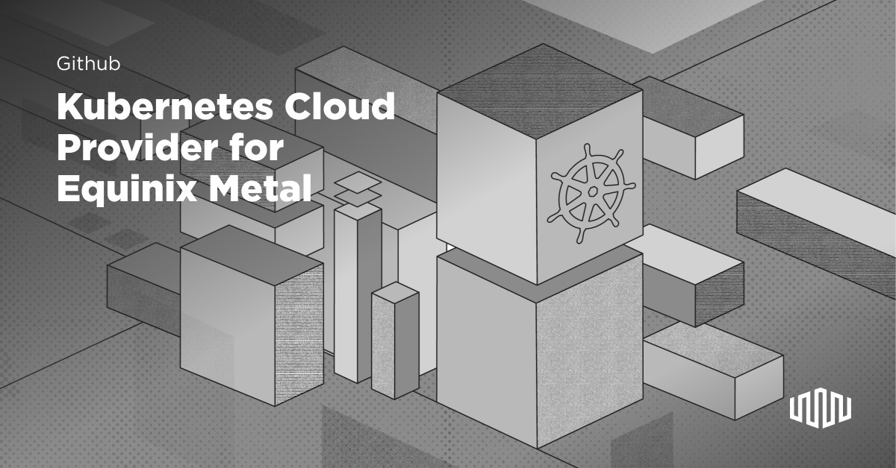

)

# Kubernetes Cloud Controller Manager for Equinix Metal

[](https://github.com/equinix/cloud-provider-equinix-metal/releases)
[](https://goreportcard.com/report/github.com/equinix/cloud-provider-equinix-metal)

[](https://hub.docker.com/r/equinix/cloud-provider-equinix-metal/)
[](https://slack.equinixmetal.com/)
[](https://twitter.com/intent/follow?screen_name=equinixmetal&user_id=788180534543339520)


`cloud-provider-equinix-metal` is the Kubernetes CCM implementation for Equinix Metal. Read more about the CCM in [the official Kubernetes documentation](https://kubernetes.io/docs/tasks/administer-cluster/running-cloud-controller/).

This repository is [Maintained](https://github.com/packethost/standards/blob/master/maintained-statement.md)!

## Requirements

At the current state of Kubernetes, running the CCM requires a few things.
Please read through the requirements carefully as they are critical to running the CCM on a Kubernetes cluster.

### Version
Recommended versions of Equinix Metal CCM based on your Kubernetes version:

* Equinix Metal CCM version v0.0.4 supports Kubernetes version >=v1.10
* Equinix Metal CCM version v1.0.0+ supports Kubernetes version >=1.15.0

### BGP

If you plan on using a BGP, for example for a BGP-based load balancer, you _may_ need to set static routes on your hosts.

Details about BGP can be found in [the official Equinix Metal BGP documentation](https://metal.equinix.com/developers/docs/networking/local-global-bgp/#server-host-configuration).

Equinix Metal facilities provide BGP peers at certain addresses, normally `169.254.255.1` and `169.254.255.2`. These are available
in the host configuration via the Equinix Metal API, as well as the [metadata](https://metal.equinix.com/developers/docs/servers/metadata/)
on each host.

In order for BGP peering to work, the upstream BGP peers _must_ receive the packets from your device's _private_ IP address.
If they come from the _public_ address, they will be dropped.

There are two ways to get the packets to have the correct source address:

* use BGP software that knows how to set the source address on a packet
* set static routes on your host

#### BGP Software

Some implementations of BGP software support setting a source address for BGP peering packets, including
[bird](https://bird.network.cz) and [kube-vip](https://kube-vip.io).

CCM helps in this regard. It reads the information about the peers and the correct source address for the device from
the Equinix Metal API, and then sets those as annotations on the host. Software that knows how to read those annotations,
for example, kube-vip, will do the right thing. There will be no need to set static routes.

#### Static Routes

If your BGP software does not support using a specific source IP, then you must set static routes.

You need to retrieve the following:

* your private IPv4 upstream gateway address
* your BGP peer addresses

Before you can retrieve the information, you must enable BGP at both the Equinix Metal project level, and for each device.
You can do this in the Equinix Metal Web UI, API or CLI. CCM ensures these settings on the project and each device. However,
if you wish to retrieve the information _before_ CCM enables it, for example to run the configuration below, you may need
to enable it first.

A sample method:

```bash
GATEWAY_IP=$(curl https://metadata.platformequinix.com/metadata | jq -r '.network.addresses[] | select(.public == false and .address_family == 4) | .gateway')
PEERS=$(curl https://metadata.platformequinix.com/metadata | jq -r '.bgp_neighbors[0].peer_ips[]')
for i in ${PEERS}; do
ip route add ${i} via $GATEWAY_IP
done
```

## Deployment

**TL;DR**

1. Set kubernetes binary arguments correctly
1. Get your Equinix Metal project and secret API token
1. Deploy your Equinix Metal project and secret API token to your cluster in a [Secret](https://kubernetes.io/docs/concepts/configuration/secret/)
1. Deploy the CCM
1. Deploy the load balancer (optional)

### Kubernetes Binary Arguments

Control plane binaries in your cluster must start with the correct flags:

* `kubelet`: All kubelets in your cluster **MUST** set the flag `--cloud-provider=external`. This must be done for _every_ kubelet. Note that [k3s](https://k3s.io) sets its own CCM by default. If you want to use the CCM with k3s, you must disable the k3s CCM and enable this one, as `--disable-cloud-controller --kubelet-arg cloud-provider=external`.
* `kube-apiserver` and `kube-controller-manager` must **NOT** set the flag `--cloud-provider`. They then will use no cloud provider natively, leaving room for the Equinix Metal CCM.

**WARNING**: setting the kubelet flag `--cloud-provider=external` will taint all nodes in a cluster with `node.cloudprovider.kubernetes.io/uninitialized`.
The CCM itself will untaint those nodes when it initializes them.
Any pod that does not tolerate that taint will be unscheduled until the CCM is running.

You **must** set the kubelet flag the first time you run the kubelet. Stopping the kubelet, adding it after,
and then restarting it will not work.

#### Kubernetes node names must match the device name

By default, the kubelet will name nodes based on the node's hostname.
Equinix Metal's device hostnames are set based on the name of the device.
It is important that the Kubernetes node name matches the device name.

### Get Equinix Metal Project ID and API Token

To run `cloud-provider-equinix-metal`, you need your Equinix Metal project ID and secret API key ID that your cluster is running in.
If you are already logged into the [Equinix Metal portal](https://console.equinix.com/), you can create one by clicking on your
profile in the upper right then "API keys".
To get your project ID click into the project that your cluster is under and select "project settings" from the header.
Under General you will see "Project ID". Once you have this information you will be able to fill in the config needed for the CCM.

### Deploy Project and API

Copy [deploy/template/secret.yaml](./deploy/template/secret.yaml) to someplace useful:

```bash
cp deploy/template/secret.yaml /tmp/secret.yaml
```

Replace the placeholder in the copy with your token. When you're done, the `yaml` should look something like this:

```yaml
apiVersion: v1
kind: Secret
metadata:
  name: metal-cloud-config
  namespace: kube-system
stringData:
  cloud-sa.json: |
    {
    "apiKey": "abc123abc123abc123",
    "projectID": "abc123abc123abc123"
    }  
```


Then apply the secret, e.g.:

```bash
kubectl apply -f /tmp/secret.yaml`
```

You can confirm that the secret was created with the following:

````bash
$ kubectl -n kube-system get secrets metal-cloud-config
NAME                  TYPE                                  DATA      AGE
metal-cloud-config   Opaque                                1         2m
````

### Deploy CCM

To apply the CCM itself, select your release and apply the manifest:

```
RELEASE=v2.0.0
kubectl apply -f https://github.com/equinix/cloud-provider-equinix-metal/releases/download/${RELEASE}/deployment.yaml
```

The CCM uses multiple configuration options. See the [configuration][#Configuration] section for all of the options.

#### Deploy Load Balancer

If you want load balancing to work as well, deploy a supported load-balancer.

CCM provides the correct logic, if necessary, to manage load balancer configs for supported load-balancers.

See further in this document under loadbalancing, for details.

### Logging

By default, ccm does minimal logging, relying on the supporting infrastructure from kubernetes. However, it does support
optional additional logging levels via the `--v=<level>` flag. In general:

* `--v=2`: log most function calls for devices and facilities, when relevant logging the returned values
* `--v=3`: log additional data when logging returned values, usually entire go structs
* `--v=5`: log every function call, including those called very frequently

## Configuration

The Equinix Metal CCM has multiple configuration options. These include three different ways to set most of them, for your convenience.

1. Command-line flags, e.g. `--option value` or `--option=value`; if not set, then
1. Environment variables, e.g. `CCM_OPTION=value`; if not set, then
1. Field in the configuration [Secret](https://kubernetes.io/docs/concepts/configuration/secret/); if not set, then
1. Default, if available; if not available, then an error

This section lists each configuration option, and whether it can be set by each method.

| Purpose | CLI Flag | Env Var | Secret Field | Default |
| --- | --- | --- | --- | --- |
| Path to config secret |    |    | `provider-config` | error |
| API Key |    | `METAL_API_KEY` | `apiKey` | error |
| Project ID |    | `METAL_PROJECT_ID` | `projectID` | error |
| Facility |    | `METAL_FACILITY_NAME` | `facility` | read metadata on host on which CCM is running, else error |
| Base URL to Equinix API |    |    | `base-url` | Official Equinix Metal API |
| Load balancer setting |   | `METAL_LOAD_BALANCER` | `loadbalancer` | none |
| BGP ASN for cluster nodes when enabling BGP on the project |   | `METAL_LOCAL_ASN` | `localASN` | `65000` |
| BGP passphrase to use when enabling BGP on the project |   | `METAL_BGP_PASS` | `bgpPass` | `""` |
| Kubernetes annotation to set node's BGP ASN |   | `METAL_ANNOTATION_LOCAL_ASN` | `annotationLocalASN` | `"metal.equinix.com/node-asn"` |
| Kubernetes annotation to set BGP peer's ASN |   | `METAL_ANNOTATION_PEER_ASNS` | `annotationPeerASNs` | `"metal.equinix.com/peer-asn"` |
| Kubernetes annotation to set BGP peer's IPs |   | `METAL_ANNOTATION_PEER_IPS` | `annotationPeerIPs` | `"metal.equinix.com/peer-ip"` |
| Kubernetes annotation to set source IP for BGP peering |   | `METAL_ANNOTATION_SRC_IP` | `annotationSrcIP` | `"metal.equinix.com/src-ip"` |
| Kubernetes annotation to set BGP MD5 password, base64-encoded (see security warning below) |   | `METAL_ANNOTATION_BGP_PASS` | `annotationBGPPass` | `"metal.equinix.com/bgp-pass"` |
| Kubernetes annotation to set the CIDR for the network range of the private address |  | `METAL_ANNOTATION_NETWORK_IPV4_ PRIVATE` |  `annotationNetworkIPv4Private` | `metal.equinix.com/network/4/private` |
| Tag for control plane Elastic IP |    | `METAL_EIP_TAG` | `eipTag` | No control plane Elastic IP |
| Kubernetes API server port for Elastic IP |     | `METAL_API_SERVER_PORT` | `apiServerPort` | Same as `kube-apiserver` on control plane nodes, same as `0` |
| Filter for cluster nodes on which to enable BGP |    | `METAL_BGP_NODE_SELECTOR` | `bgpNodeSelector` | All nodes |

<u>Security Warning</u>
Including your project's BGP password, even base64-encoded, may have security implications. Because Equinix Metal
only allows communication to the BGP peer from the actual node, and not from outside, and because that password already is available
form metadata on the host, this risk may be limited. We further recommend using Kubernetes
[Network Policies](https://kubernetes.io/docs/concepts/services-networking/network-policies/) to restrict access to BGP peers solely
to system pods that have reasonable need to access them.

## How It Works

The Kubernetes CCM for Equinix Metal deploys as a `Deployment` into your cluster with a replica of `1`. It provides the following services:

* lists available zones, returning Equinix Metal regions
* lists and retrieves instances by ID, returning Equinix Metal servers
* manages load balancers

### Facility

The Equinix Metal CCM works in one facility at a time. You can control which facility it works using the facility option
in [Configuration][Configuration].

If no facility is provided, it attempts to find the facility using metadata of the node on which it is running. If it cannot
determine the metadata, for example if the CCM is running on a non-Equinix-Metal node, it will error and exit.

The overrides of environment variable and config file are provided so that you can run the CCM
on a node in a different facility, or even outside of Equinix Metal entirely.

### Load Balancers

Equinix Metal does not offer managed load balancers like [AWS ELB](https://aws.amazon.com/elasticloadbalancing/)
or [GCP Load Balancers](https://cloud.google.com/load-balancing/). Instead, if configured to do so,
Equinix Metal CCM will interface with and configure external bare-metal loadbalancers.

When a load balancer is enabled, the CCM does the following:

1. Enable BGP for the project
1. Enable BGP on each node as it comes up
1. Sets ASNs based on configuration or default
1. Get an Equinix Metal Elasic IP for each `Service` of `type=LoadBalancer`
1. Set the `Spec.LoadBalancerIP` on the `Service`
1. Pass control to the specific load balancer implementation

#### Control Plane LoadBalancer Implementation

For the control plane nodes, the Equinix Metal CCM uses static Elastic IP assignment, via the Equinix Metal API, to tell the
Equinix Metal network which control plane node should receive the traffic. For more details on the control plane
load-balancer, see [this section](#Elastic_IP_as_Control_Plane_Endpoint).

#### Service LoadBalancer Implementations

Loadbalancing is enabled as follows.

1. If the environment variable `METAL_LOAD_BALANCER` is set, read that. Else...
1. If the config file has a key named `loadbalancer`, read that. Else...
1. Load balancing is disabled.

The value of the loadbalancing configuration is `<type>:///<detail>` where:

* `<type>` is the named supported type, of one of those listed below
* `<detail>` is any additional detail needed to configure the implementation, details in the description below

For loadbalancing for Kubernetes `Service` of `type=LoadBalancer`, the following implementations are supported:

* [kube-vip](#kube-vip)
* [MetalLB](#metallb)
* [empty](#empty)

CCM does **not** deploy _any_ load balancers for you. It limits itself to managing the Equinix Metal-specific
API calls to support a load balancer, and providing configuration for supported load balancers.

##### kube-vip

When the [kube-vip](https://kube-vip.io) option is enabled, for user-deployed Kubernetes `Service` of `type=LoadBalancer`,
the Equinix Metal CCM enables BGP on the project and nodes, assigns an EIP for each such
`Service`, and adds annotations to the nodes. These annotations are configured to be consumable
by kube-vip.

To enable it, set the configuration `METAL_LOAD_BALANCER` or config `loadbalancer` to:

```
kube-vip://
```

Directions on using configuring kube-vip in this method are available at the kube-vip [site](https://kube-vip.io/hybrid/daemonset/#equinix-metal-overview-(using-the-%5Bequinix-cloud-provider-equinix-metal%5D(https://github.com/equinix/cloud-provider-equinix-metal)))

If `kube-vip` management is enabled, then CCM does the following.

1. Enable BGP on the Equinix Metal project
1. For each node currently in the cluster or added:
   * retrieve the node's Equinix Metal ID via the node provider ID
   * retrieve the device's BGP configuration: node ASN, peer ASN, peer IPs, source IP
   * add the information to appropriate annotations on the node
1. For each service of `type=LoadBalancer` currently in the cluster or added:
   * if an Elastic IP address reservation with the appropriate tags exists, and the `Service` already has that IP address affiliated with it, it is ready; ignore
   * if an Elastic IP address reservation with the appropriate tags exists, and the `Service` does not have that IP affiliated with it, add it to the [service spec](https://kubernetes.io/docs/reference/generated/kubernetes-api/v1.17/#servicespec-v1-core)
   * if an Elastic IP address reservation with the appropriate tags does not exist, create it and add it to the services spec
1. For each service of `type=LoadBalancer` deleted from the cluster:
   * find the Elastic IP address from the service spec and remove it
   * delete the Elastic IP reservation from Equinix Metal

##### MetalLB

When [MetalLB](https://metallb.universe.tf) is enabled, for user-deployed Kubernetes `Service` of `type=LoadBalancer`,
the Equinix Metal CCM uses BGP and to provide the _equivalence_ of load balancing, without
requiring an additional managed service (or hop). BGP route advertisements enable Equinix Metal's network
to route traffic for your services at the Elastic IP to the correct host.

To enable it, set the configuration `METAL_LOAD_BALANCER` or config `loadbalancer` to:

```
metallb:///<configMapNamespace>/<configMapName>
```

For example:

* `metallb:///metallb-system/config` - enable `MetalLB` management and update the configmap `config` in the namespace `metallb-system`
* `metallb:///foonamespace/myconfig` -  - enable `MetalLB` management and update the configmap `myconfig` in the namespace `foonamespae`
* `metallb:///` - enable `MetalLB` management and update the default configmap, i.e. `config` in the namespace `metallb-system`

Notice the **three* slashes. In the URL, the namespace and the configmap are in the path.

When enabled, CCM controls the loadbalancer by updating the provided `ConfigMap`.

If `MetalLB` management is enabled, then CCM does the following.

1. Get the appropriate namespace and name of the `ConfigMap`, based on the rules above.
1. If the `ConfigMap` does not exist, do the rest of the behaviours, but do not update the `ConfigMap`
1. Enable BGP on the Equinix Metal project
1. For each node currently in the cluster or added:
   * retrieve the node's Equinix Metal ID via the node provider ID
   * retrieve the device's BGP configuration: node ASN, peer ASN, peer IPs, source IP
   * add them to the metallb `ConfigMap` with a kubernetes selector ensuring that the peer is only for this node
1. For each node deleted from the cluster:
   * remove the node from the MetalLB `ConfigMap`
1. For each service of `type=LoadBalancer` currently in the cluster or added:
   * if an Elastic IP address reservation with the appropriate tags exists, and the `Service` already has that IP address affiliated with it, it is ready; ignore
   * if an Elastic IP address reservation with the appropriate tags exists, and the `Service` does not have that IP affiliated with it, add it to the [service spec](https://kubernetes.io/docs/reference/generated/kubernetes-api/v1.17/#servicespec-v1-core) and ensure it is in the pools of the MetalLB `ConfigMap` with `auto-assign: false`
   * if an Elastic IP address reservation with the appropriate tags does not exist, create it and add it to the services spec, and ensure is in the pools of the metallb `ConfigMap` with `auto-assign: false`
1. For each service of `type=LoadBalancer` deleted from the cluster:
   * find the Elastic IP address from the service spec and remove it
   * remove the IP from the `ConfigMap`
   * delete the Elastic IP reservation from Equinix Metal

CCM itself does **not** deploy the load-balancer or any part of it, including the `ConfigMap`. It only
modifies an existing `ConfigMap`. This can be deployed by the administrator separately, using the manifest
provided in the releases page, or in any other manner.

##### empty

When the `empty` option is enabled, for user-deployed Kubernetes `Service` of `type=LoadBalancer`,
the Equinix Metal CCM enables BGP on the project and nodes, assigns an EIP for each such
`Service`, and adds annotations to the nodes. It does not integrate directly with any load balancer.
This is useful if you have your own implementation, but want to leverage Equinix Metal CCM's
management of BGP and EIPs.

To enable it, set the configuration `METAL_LOAD_BALANCER` or config `loadbalancer` to:

```
empty://
```

If `empty` management is enabled, then CCM does the following.

1. Enable BGP on the Equinix Metal project
1. For each node currently in the cluster or added:
   * retrieve the node's Equinix Metal ID via the node provider ID
   * retrieve the device's BGP configuration: node ASN, peer ASN, peer IPs, source IP
   * add the information to appropriate annotations on the node
1. For each service of `type=LoadBalancer` currently in the cluster or added:
   * if an Elastic IP address reservation with the appropriate tags exists, and the `Service` already has that IP address affiliated with it, it is ready; ignore
   * if an Elastic IP address reservation with the appropriate tags exists, and the `Service` does not have that IP affiliated with it, add it to the [service spec](https://kubernetes.io/docs/reference/generated/kubernetes-api/v1.17/#servicespec-v1-core)
   * if an Elastic IP address reservation with the appropriate tags does not exist, create it and add it to the services spec
1. For each service of `type=LoadBalancer` deleted from the cluster:
   * find the Elastic IP address from the service spec and remove it
   * delete the Elastic IP reservation from Equinix Metal

### Language

In order to ease understanding, we use several different terms for an IP address:

* Requested: A dedicated `/32` IP address has been requested for the service from Equinix Metal. It may be returned immediately, or it may need to wait for Equinix Metal intervention.
* Reserved: A dedicated `/32` IP address has been reserved for the service from Equinix Metal.
* Assigned: The dedicated IP address has been marked on the service as `Service.Spec.LoadBalancerIP` as assigned.
* Mapped: The dedicated IP address has been added to the metallb `ConfigMap` as available.

From Equinix Metal's perspective, the IP reservation is either Requested or Reserved, but not both. For the
load balancer to work, the IP address needs to be all of: Reserved, Assigned, Mapped.

## Control Plane Load Balancing

CCM implements an optional control plane load balancer using an Equinix Metal Elastic IP (EIP) and the Equinix Metal API's
ability to assign that EIP to different devices.

You have several options for control plane load-balancing:

* CCM managed
* kube-vip managed
* No control plane load-balancing (or at least, none known to CCM)

### CCM Managed

It is a common procedure to use Elastic IP as Control Plane endpoint in order to
have a static endpoint that you can use from the outside, or when configuring
the advertise address for the kubelet.

To enable CCM to manage the control plane EIP:

1. Create an Elastic IP, using the Equinix Metal API, Web UI or CLI
1. Put an arbitrary but unique tag on the EIP
1. When starting the CCM
   * set the [configuration][Configuration] for the control plane EIP tag, e.g. env var `METAL_EIP_TAG=<tag>`, where `<tag>` is whatever tag you set on the EIP
   * (optional) set the port that the EIP should listen on; by default, or when set to `0`, it will use the same port as the `kube-apiserver` on the control plane nodes. This port can also be specified with `METAL_API_SERVER_PORT=<port>.`

In [CAPP](https://github.com/kubernetes-sigs/cluster-api-provider-packet) we
create one for every cluster for example. Equinix Metal does not provide an as a
service load balancer it means that in some way we have to check if the Elastic
IP is still assigned to an healthy control plane.

In order to do so CCM implements a reconciliation loop that checks if the
Control Plane Endpoint respond correctly using the `/healthz` endpoint.

When the healthcheck fails CCM looks for the other Control Planes, when it gets
a healthy one it move the Elastic IP to the new device.

This feature by default is disabled and it assumes that the ElasticIP for the
cluster is available and tagged with an arbitrary label. CAPP for example uses:

```
cluster-api-provider-packet:cluster-id:<clusterName>
```

When the tag is present CCM will filter the available elastic ip for the
specified project via tag to lookup the one used by your cluster.

It will check the correct answer, when it stops responding the IP reassign logic
will start.

The logic will circle over all the available control planes looking for an
active api server. As soon as it can find one the Elastic IP will be unassigned
and reassigned to the working node.

#### How the Elastic IP Traffic is Routed

Of course, even if the router sends traffic for your Elastic IP (EIP) to a given control
plane node, that node needs to know to process the traffic. Rather than require you to
manage the IP assignment on each node, which can lead to some complex timing issues,
the Equinix Metal CCM handles it for you.

The structure relies on the already existing `default/kubernetes` service, which
creates an `Endpoints` structure that includes all of the functioning control plane
nodes. The CCM does the following on each loop:

1. Reads the Kubernetes-created `default/kubernetes` service to discover:
   * what port `kube-apiserver` is listening on from `targetPort`
   * all of the endpoints, i.e. control plane nodes where `kube-apiserver` is running
1. Creates a service named `kube-system/cloud-provider-equinix-metal-kubernetes-external` with the following settings:
   * `type=LoadBalancer`
   * `spec.loadBalancerIP=<eip>`
   * `status.loadBalancer.ingress[0].ip=<eip>`
   * `metadata.annotations["metallb.universe.tf/address-pool"]=disabled-metallb-do-not-use-any-address-pool`
   * `spec.ports[0].targetPort=<targetPort>`
   * `spec.ports[0].port=<targetPort_or_override>`
1. Updates the service `kube-system/cloud-provider-equinix-metal-kubernetes-external` to have endpoints identical to those in `default/kubernetes`

This has the following effect:

* the annotation prevents metallb from trying to manage the IP
* the name prevents CCM from passing it to the loadbalancer provider address mapping, thus preventing any of them from managing it
* the `spec.loadBalancerIP` and `status.loadBalancer.ingress[0].ip` cause kube-proxy to set up routes on all of the nodes
* the endpoints cause the traffic to be routed to the control plane nodes

Note that we _wanted_ to just set `externalIPs` on the original `default/kubernetes`, but that would prevent traffic
from being routed to it from the control nodes, due to iptables rules. LoadBalancer types allow local traffic.

### kube-vip Managed

kube-vip has the ability to manage the Elastic IP and control plane load-balancing. To enable it:

1. Disable CCM control-plane load-balancing, by ensuring the EIP tag setting is empty via `METAL_EIP_TAG=""`
1. Enable kube-vip control plane load-balancing by following the instructions [here](https://kube-vip.io/hybrid/static/#bgp-with-equinix-metal)

## Core Control Loop

On startup, the CCM executes the following core control loop:

1. List each node in the cluster using a kubernetes node lister
   * for each node, call the node processing function in "sync" mode on each area, such as loadbalancers, bgp, devices, etc.
1. List each service in the cluster using a kubernetes service lister
   * for each node, if it is of `type=LoadBalancer`, call the service processing function in "sync" mode on each area, such as loadbalancers, bgp, devices, etc.
1. Start a kubernetes informer for node changes, responding to node addition and removals
   * for each node added, call the node processing function in "add" mode on each area
   * for each node removed, call the node processing function in "remove" mode on each area
1. Start a kubernetes informer for service changes, responding to service addition and removals of `type=LoadBalancer`
   * for each service added, call the service processing function in "add" mode on each area
   * for each service removed, call the service processing function in "remove" mode on each area
1. Start an independent loop that checks every 30 seconds (configurable) for the following:
   * list all nodes in the cluster using a kubernetes node lister, and call the node processing function in "sync" mode on each area
   * list all services in the cluster of `type=LoadBalancer`, and call the service processing function in "sync" mode on each area

## BGP Configuration

If a loadbalancer is enabled, the CCM enables BGP for the project and enables it by default
on all nodes as they come up. It sets the ASNs as follows:

* Node, a.k.a. local, ASN: `65000`
* Peer Router ASN: `65530`

These are the settings per Equinix Metal's BGP config, see [here](https://github.com/packet-labs/kubernetes-bgp). It is
_not_ recommended to override them. However, you can do so, using the options in [Configuration][Configuration].

Set of servers on which BGP will be enabled can be filtered as well, using the the options in [Configuration][Configuration].
Value for node selector should be a valid Kubernetes label selector (e.g. key1=value1,key2=value2).

## Node Annotations

The Equinix Metal CCM sets Kubernetes annotations on each cluster node:

* Node, or local, ASN, default annotation `metal.equinix.com/node-asn`
* Peer ASNs, comma-separated if multiple, default annotation `metal.equinix.com/peer-asns`
* Peer IPs, comma-separated if multiple, default annotation `metal.equinix.com/peer-ips`
* Source IP to use when communicating with upstream peers, default annotation `metal.equinix.com/src-ip`
* CIDR of the private network range in the project which this node is part of, default annotation `metal.equinix.com/network-ipv4/private`

These annotation names can be overridden, if you so choose, using the options in [Configuration][Configuration].

## Elastic IP Configuration

If a loadbalancer is enabled, CCM creates an Equinix Metal Elastic IP (EIP) reservation for each `Service` of
`type=LoadBalancer`. It tags the Reservation with the following tags:

* `usage="cloud-provider-equinix-metal-auto"`
* `service="<service-hash>"` where `<service-hash>` is the sha256 hash of `<namespace>/<service-name>`. We do this so that the name of the service does not leak out to Equinix Metal itself.
* `cluster=<clusterID>` where `<clusterID>` is the UID of the immutable `kube-system` namespace. We do this so that if someone runs two clusters in the same project, and there is one `Service` in each cluster with the same namespace and name, then the two EIPs will not conflict.

IP addresses always are created `/32`.

## Running Locally

You can run the CCM locally on your laptop or VM, i.e. not in the cluster. This _dramatically_ speeds up development. To do so:

1. Deploy everything except for the `Deployment` and, optionally, the `Secret`
1. Build it for your local platform `make build`
1. Set the environment variable `CCM_SECRET` to a file with the secret contents as a json, i.e. the content of the secret's `stringData`, e.g. `CCM_SECRET=ccm-secret.yaml`
1. Set the environment variable `KUBECONFIG` to a kubeconfig file with sufficient access to the cluster, e.g. `KUBECONFIG=mykubeconfig`
1. Set the environment variable `METAL_FACILITY_NAME` to the correct facility where the cluster is running, e.g. `METAL_FACILITY_NAME=ewr1`
1. If you want to run the loadbalancer, and it is not yet deployed, run `kubectl apply -f deploy/loadbalancer.yaml`
1. Enable the loadbalancer by setting the environment variable `METAL_LOAD_BALANCER=metallb://`
1. If you want to use a managed Elastic IP for the control plane, create one using the Equinix Metal API or Web UI, tag it uniquely, and set the environment variable `METAL_EIP_TAG=<tag>`
1. Run the command, e.g.:

```
METAL_FACILITY_NAME=${METAL_FACILITY_NAME} METAL_LOAD_BALANCER=metallb:// dist/bin/cloud-provider-equinix-metal-darwin-amd64 --cloud-provider=equinixmetal --leader-elect=false --authentication-skip-lookup=true --provider-config=$CCM_SECRET --kubeconfig=$KUBECONFIG
```

For lots of extra debugging, add `--v=2` or even higher levels, e.g. `--v=5`.
